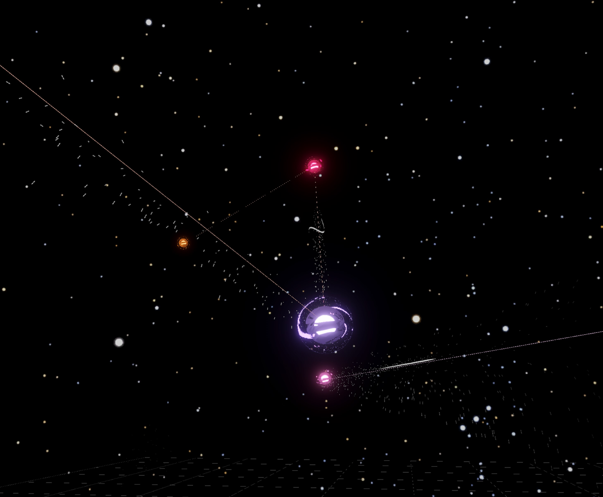
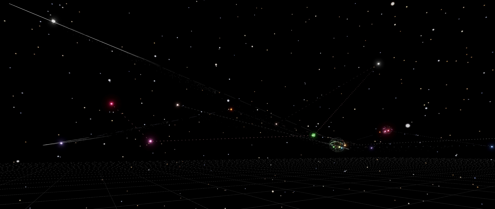
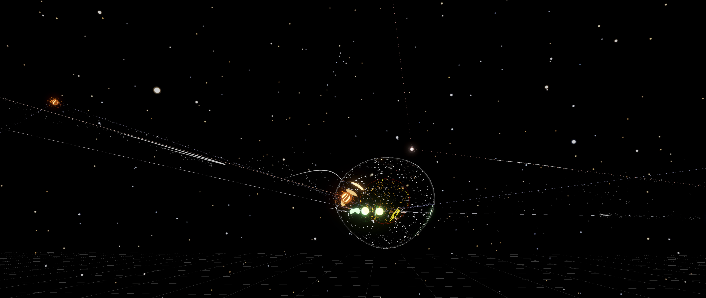

# thesis-unity-prototype

The prototype was developed in Unity using C# and focuses on translating real-world spatial data into an interactive digital environment. It includes systems for handling spatial grids, converting real-world coordinates into Unity and generating elements based on location and user input.

Agent responses are stored and visualized as spatial data, allowing patterns and clusters to emerge. These clusters are analyzed and organised dynamically, forming spatial representations.

The uploaded scripts represent selected systems from the larger Unity prototype. Specifically, the scripts showcase the clustering logic, emotion data collection logic and region-based data classification within the simulated urban environment.

  

  

  

